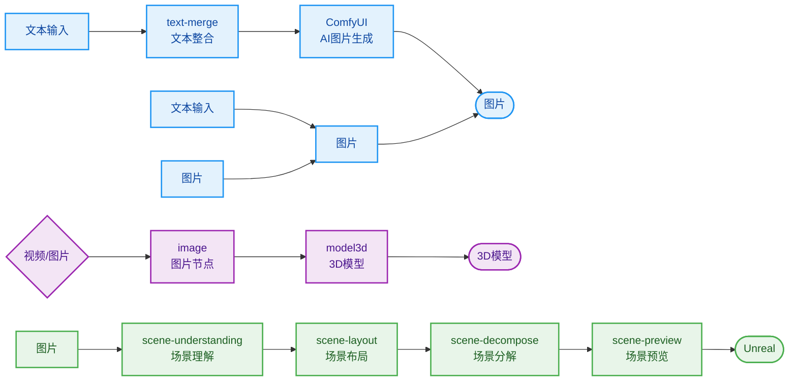
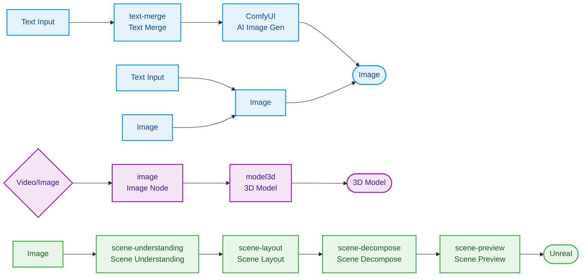

# DVStudio

🎨 **AI 时代的资产管理与创作平台 / Asset Management & Creation Platform for the AI Era**

[中文](#中文) | [English](#english)

🔗 [开源仓库 / Repository](https://github.com/412845222/DVStudio) · [官方网站 / Website](https://www.dweb.club/) · [B站频道 / Bilibili](https://space.bilibili.com/22690066)

---

# 中文

DVStudio 是一款面向 AI 创作者的桌面端创作工具。从文本描述到图片生成，从视频处理到 3D 场景布局，让创作者专注于创意表达。

## ✨ 核心能力

| 能力 | 说明 |
|---|---|
| 🧩 **AI 工作流编排** | 节点式 AI 流程设计，像搭积木一样编排创作流水线 |
| 🧠 **Agent Skills** | 场景理解、场景布局、场景拆解、Unreal 导出 |

---

## 🚀 快速上手

**环境要求**：Node.js `>=16`（建议 18+）

```bash
# 安装依赖
npm install

# 启动开发
npm run dev:electron              # 桌面端开发
npm run dev:web                   # 纯前端预览

# 构建与打包
npm run build                     # 构建生产版本
npm run dist:win                  # 打包 Windows 安装包
npm run dist:mac                  # 打包 macOS
```

---

## 🔮 AI 工作流蓝图

可视化编排 AI 创作流程，像搭积木一样设计你的创作流水线。

> **核心创作路径**：文本 → 图片 → 视频 / 3D 模型 / 场景布局

### 工作流程图



### 节点类型详解

#### 📥 资源输入节点

| 节点 | 功能 | 使用场景 |
|---|---|---|
| **文本输入 (text-input)** | 创建文本输入节点 | 输入提示词、描述文本 |
| **文本节点 (text-generation)** | 保存提示词、文案 | 输入给 AI 节点作为生成提示词 |
| **图片节点 (image)** | 承载图片资源 | 作为参考图、底图或 ComfyUI 输入 |
| **视频节点 (video)** | 承载视频资源 | 视频处理、转场、抽帧等 |
| **3D 模型节点 (model3d)** | 预览、承接和输出 3D 模型资源 | 管理和展示生成的 3D 模型 |
| **场景理解 (scene-understanding)** | 对图片或文本做场景结构化理解 | 提取场景信息、物体关系 |
| **场景拆解 (scene-decompose)** | 拆解场景图片并输出图片与结构化信息 | 分解场景为多个元素 |

#### ⚙️ 处理编排节点

| 节点 | 功能 | 使用场景 |
|---|---|---|
| **文本整合 (text-merge)** | 将多个文本输入整合为单一输出 | 组合多条提示词、添加前缀后缀 |
| **剧情分支 (story)** | 创建分支流程 | 实现多结局、分支剧情、并行处理 |
| **旋转图片 (rotate-image)** | 旋转图片并生成新视角 | 图片角度调整、多视角生成 |

#### ✨ AI 生成节点

| 节点 | 功能 | 使用场景 |
|---|---|---|
| **ComfyUI** | 集成 ComfyUI 工作流 | 调用本地 ComfyUI 执行自定义 AI 图像生成 |
| **场景布局 (scene-layout)** | 生成或编辑可导向 3D 场景的布局信息 | 定义物体位置、光照、相机角度等 |

### 典型创作路径

#### 路径 1：文本 → 图片 → 视频

`文本输入 → ComfyUI → 图片 → 视频节点`

1. 通过文本节点编写提示词
2. ComfyUI 生成图片
3. 图片节点输出给视频节点进行后续处理

#### 路径 2：图片 → 3D 模型 → 场景布局

`图片 → 3D 模型节点 → 场景布局 → 导出`

1. 导入参考图片
2. 3D 模型节点生成或承接 3D 模型（支持 Meshy 图生 3D）
3. 场景布局节点编排多个物体的位置关系
4. 导出到其他 3D 软件进行渲染

#### 路径 3：场景理解与拆解

`图片 → 场景理解 → 场景拆解 → 元素图片 + 结构化信息`

1. 导入场景图片
2. 场景理解节点提取结构化信息
3. 场景拆解节点分解场景为多个元素

---

## 🔗 相关链接

- [官方网站](https://www.dweb.club/)
- [开源仓库](https://github.com/412845222/DVStudio)
- [B 站频道](https://space.bilibili.com/22690066)（B 站充电包月进入赞助交流群）

---

## 📄 License

Mozilla Public License v2.0 © DwebStudio

---

# English

DVStudio is a desktop creation tool for AI creators. From text descriptions to image generation, from video processing to 3D scene layout, it lets creators focus on creative expression.

## ✨ Core Capabilities

| Capability | Description |
|---|---|
| 🧩 **AI Workflow Orchestration** | Node-based AI process design, orchestrate creation pipelines like building blocks |
| 🧠 **Agent Skills** | Scene Understanding, Scene Layout, Scene Decompose, Unreal Export |

---

## 🚀 Quick Start

**Requirements**: Node.js `>=16` (18+ recommended)

```bash
# Install dependencies
npm install

# Development
npm run dev:electron              # Desktop development
npm run dev:web                   # Frontend-only preview

# Build & Package
npm run build                     # Build production version
npm run dist:win                  # Package Windows installer
npm run dist:mac                  # Package macOS
```

---

## 🔮 AI Workflow Blueprint

Visually orchestrate AI creation workflows — design your creative pipeline like building blocks.

> **Core Creation Path**: Text → Image → Video / 3D Model / Scene Layout

### Workflow Diagram



### Node Types

#### 📥 Resource Input Nodes

| Node | Function | Use Case |
|---|---|---|
| **Text Input (text-input)** | Create a text input node | Enter prompts, descriptive text |
| **Text Node (text-generation)** | Save prompts, copy | Feed as generation prompt to AI nodes |
| **Image Node (image)** | Carry image resources | As reference image, base image, or ComfyUI input |
| **Video Node (video)** | Carry video resources | Video processing, transitions, frame extraction |
| **3D Model Node (model3d)** | Preview, carry and output 3D model resources | Manage and display generated 3D models |
| **Scene Understanding (scene-understanding)** | Structured understanding of scenes from images or text | Extract scene info, object relationships |
| **Scene Decompose (scene-decompose)** | Decompose scene images and output images with structured info | Break down scenes into multiple elements |

#### ⚙️ Processing & Orchestration Nodes

| Node | Function | Use Case |
|---|---|---|
| **Text Merge (text-merge)** | Merge multiple text inputs into a single output | Combine multiple prompts, add prefix/suffix |
| **Story Branch (story)** | Create branching workflows | Multi-ending stories, branch plots, parallel processing |
| **Rotate Image (rotate-image)** | Rotate image and generate new viewpoints | Image angle adjustment, multi-view generation |

#### ✨ AI Generation Nodes

| Node | Function | Use Case |
|---|---|---|
| **ComfyUI** | Integrate ComfyUI workflows | Call local ComfyUI for custom AI image generation |
| **Scene Layout (scene-layout)** | Generate or edit layout info that can be directed to 3D scenes | Define object positions, lighting, camera angles, etc. |

### Typical Creation Paths

#### Path 1: Text → Image → Video

`Text Input → ComfyUI → Image → Video Node`

1. Write prompts via text nodes
2. ComfyUI generates images
3. Image node outputs to video node for further processing

#### Path 2: Image → 3D Model → Scene Layout

`Image → 3D Model Node → Scene Layout → Export`

1. Import reference image
2. 3D Model node generates or carries 3D model (supports Meshy image-to-3D)
3. Scene Layout node orchestrates positions of multiple objects
4. Export to other 3D software for rendering

#### Path 3: Scene Understanding & Decompose

`Image → Scene Understanding → Scene Decompose → Element Images + Structured Info`

1. Import scene image
2. Scene Understanding node extracts structured info
3. Scene Decompose node breaks down scene into multiple elements

---

## 🔗 Related Links

- [Website](https://www.dweb.club/)
- [Repository](https://github.com/412845222/DVStudio)
- [Bilibili Channel](https://space.bilibili.com/22690066) (Bilibili charging members join the sponsor community)

---

## 📄 License

Mozilla Public License v2.0 © DwebStudio
