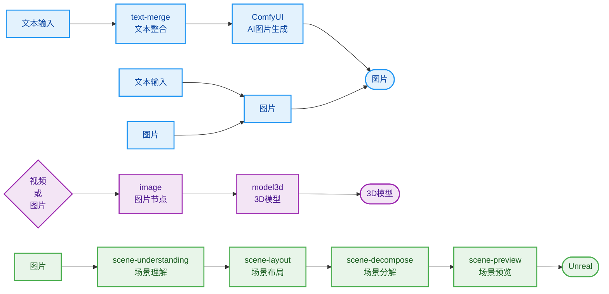

# DVStudio

🎨 **AI 时代的资产管理与创作平台**

DVStudio 是面向 AI 创作者的一站式资产管理与工作流编排工具。从文本描述到图片生成，从视频处理到 3D 场景布局，让创作者专注于创意表达。

🔗 [开源仓库](https://github.com/412845222/DVStudio) · [官方网站](https://www.dweb.club/) · [B站频道](https://space.bilibili.com/22690066)

---

## ✨ 核心能力

| AI 工作流编排 | 视频编辑器 | 本地资产管理 |
|:---:|:---:|:---:|
| 节点式 AI 流程设计 | 关键帧动画时间轴 | 项目资产统一管理 |

---

## 🚀 快速上手

```bash
# 安装依赖
npm install

# 启动开发
npm run dev:electron        # 桌面端开发
npm run dev:web             # 纯前端预览

# 构建与打包
npm run build              # 构建生产版本
npm run dist:win           # 打包 Windows 安装包
npm run dist:mac           # 打包 macOS
```

**环境要求**：Node.js 16+（建议 18+）

---

## 🔮 AI 工作流蓝图

可视化编排 AI 创作流程，像搭积木一样设计你的创作流水线。

> **核心创作路径**：文本 → 图片 → 视频 / 3D模型 / 场景布局

### 工作流程图



### 节点类型详解

#### 📥 资源输入节点

| 节点 | 功能 | 使用场景 |
|---|---|---|
| **文本输入 (text-input)** | 创建文本输入节点 | 输入提示词、描述文本 |
| **文本节点 (text-generation)** | 保存提示词、文案 | 输入给 AI 节点作为生成提示词 |
| **图片节点 (image)** | 承载图片资源 | 作为参考图、底图或 ComfyUI 输入 |
| **视频节点 (video)** | 承载视频资源 | 视频处理、转场、抽帧等 |
| **3D模型节点 (model3d)** | 预览、承接和输出 3D 模型资源 | 管理和展示生成的 3D 模型 |
| **场景理解 (scene-understanding)** | 对图片或文本做场景结构化理解 | 提取场景信息、物体关系 |
| **场景拆解 (scene-decompose)** | 拆解场景图片并输出图片与结构化信息 | 分解场景为多个元素 |

#### ⚙️ 处理编排节点

| 节点 | 功能 | 使用场景 |
|---|---|---|
| **文本整合 (text-merge)** | 将多个文本输入整合为单一输出 | 组合多条提示词、添加前缀后缀 |
| **剧情分支 (story)** | 创建分支流程 | 实现多结局、分支剧情、并行处理 |
| **旋转图片 (rotate-image)** | 旋转图片并生成新视角 | 图片角度调整、多视角生成 |

#### ✨ AI 生成节点

| 节点 | 功能 | 使用场景 |
|---|---|---|
| **ComfyUI** | 集成 ComfyUI 工作流 | 调用本地 ComfyUI 执行自定义 AI 图像生成 |
| **场景布局 (scene-layout)** | 生成或编辑可导向 3D 场景的布局信息 | 定义物体位置、光照、相机角度等 |

### 典型创作路径

#### 路径 1：文本 → 图片 → 视频

```
文本输入 → ComfyUI → 图片 → 视频节点
```

1. 通过文本节点编写提示词
2. ComfyUI 生成图片
3. 图片节点输出给视频节点进行后续处理

#### 路径 2：图片 → 3D 模型 → 场景布局

```
图片 → 3D模型节点 → 场景布局 → 导出
```

1. 导入参考图片
2. 3D模型节点生成或承接 3D 模型（支持 Meshy 图生3D）
3. 场景布局节点编排多个物体的位置关系
4. 导出到其他 3D 软件进行渲染

#### 路径 3：场景理解与拆解

```
图片 → 场景理解 → 场景拆解 → 分别输出元素图片 + 结构化信息
```

1. 导入场景图片
2. 场景理解节点提取结构化信息
3. 场景拆解节点分解场景为多个元素

---

## 🎬 视频编辑器

专业级时间轴编辑，支持关键帧动画与 AI 辅助。

### 核心功能

| 功能 | 说明 |
|---|---|
| **时间轴编辑** | FPS、总帧数、关键帧、缓动曲线 |
| **舞台节点** | 矩形、文字、图片、线条 |
| **AI 辅助** | 自然语言生成布局、批量修改样式、滤镜生成 |

### 工作区布局

```mermaid
flowchart TB
    A[菜单栏 / 工具栏]
    subgraph 主区域
        direction LR
        B[舞台预览<br/>(WebGL2 渲染)]
        C[属性面板]
    end
    D[组件库面板]
    E[时间轴面板<br/>[图层][关键帧][音频波形][缓动曲线]]
    A --> 主区域
    主区域 --> D
    D --> E
```

---

## 💾 本地资产数据库

项目资产统一管理，支持 `dweb://` 协议直接访问：

```
DVSResource/
├── UserSettings/       # 用户设置
├── BackendData/        # 后端数据
├── Projects/          # 项目文件
└── Logs/              # 运行日志
```

- **项目持久化**：每个项目保存为本地文件夹 + 数据库记录
- **资产安全**：API 密钥加密存储，本地优先
- **便携模式**：数据保存在安装目录旁，绿色便携

---

## 📁 项目结构

```
DVStudio/
├── src/                    # 前端源码（Vue 3 + TypeScript）
│   ├── views/              # 页面视图
│   │   ├── AIWorkflow.vue  # AI 工作流蓝图
│   │   └── VideoStudio.vue # 视频编辑器
│   ├── engine/             # WebGL2 渲染引擎
│   └── network/            # IPC 通信层
├── electron/                # Electron 桌面端
│   ├── backend/            # Node.js IPC 后端
│   │   └── modules/        # 功能模块
│   │       ├── chat/       # AI 对话
│   │       ├── comfyui/    # ComfyUI 桥接
│   │       ├── meshy/      # Meshy 3D
│   │       └── seedance/   # Seedance 视频
│   ├── localdb/            # SQLite 本地数据库
│   └── platform/           # 平台抽象层
└── public/                 # 静态资源
```

---

## 🔗 相关链接

- [官方网站](https://www.dweb.club/)
- [开源仓库](https://github.com/412845222/DVStudio)
- [B站频道](https://space.bilibili.com/22690066)（B站包月进入赞助交流群）

---

## 📄 License

Mozilla Public License v2.0 © DwebStudio
